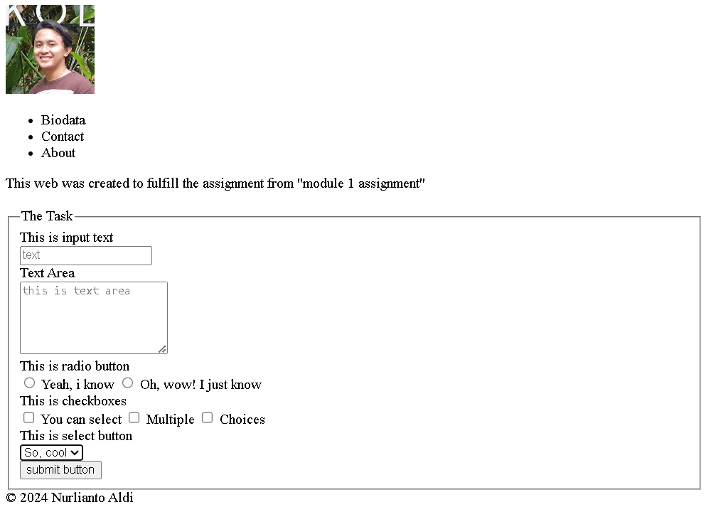

[the result]()

# Module 1 Assignment

## About

Name    : Nurlianto Aldi

Section : Paris

Team    : 3

## Description of what i build

### Feature
- Header
  - logo
  - navigation
- Main
  - Description Section
  - Article Section
    - Form Section
      - Legend
      - Input Text
      - Text Area
      - radio button
      - checkbox
      - select button
      - submit button
- Footer
  - Copyright
  
## Note
I add comment for some tags to indicate each section. I'm not choose a topic yet since it's not so fun to build the website without CSS. So i choose to describe the assignment instead. 

## Screenshot of the result

### Github Check

This is a checkpoint to see if i already success in push to Github

#Update With Final Checkpoint
i update the website further more. I add 3 pages and add CSS to it including media query for mobile.
[Here is the link]((https://revou-fsse-oct24.github.io/module-1-Nurlianto-Aldi/)
